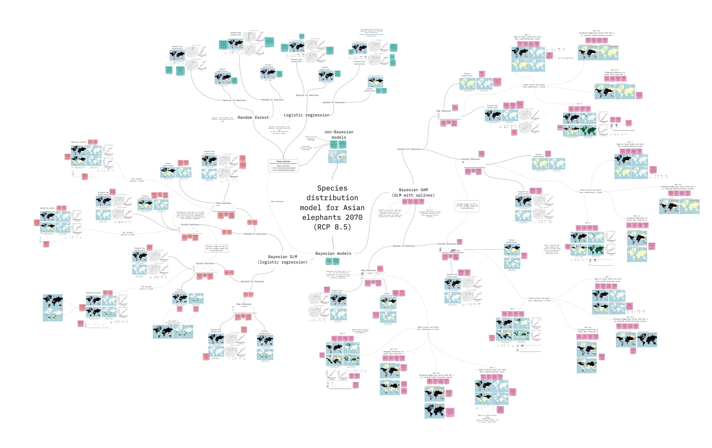

## Portfolio

---

### My Github Repositories 

[Creating a RAG pipeline from Flemish parliament discussions](https://github.com/RyokoNod/rag-flempar/blob/main/README.md)
This is repository for another [blog series](https://medium.com/@Datamarinier/creating-a-rag-from-parliament-discussions-introduction-dfb840453303) with Datamarinier. Here I walk readers through creating a simple RAG pipeline that runs on your laptop.

[Making an API out of a Hugging Face model](https://github.com/RyokoNod/skill-recommendation-blog) 
This is the repository for the [blog series](https://medium.com/@Datamarinier/making-an-api-out-of-a-hugging-face-model-introduction-a0c4b2408f52) I wrote with my employer, [Datamarinier](https://datamarinier.be/), before I officially joined their team. I used one of the non-LLM transformers to create an API that will parse skills from a CV.

[Predicting the habitat suitability for elephants in 2070](https://github.com/RyokoNod/sdm-asian-elephants)
This is the repository of my published article, [Predicting habitat suitability for Asian elephants in non-analog ecosystems with Bayesian models](https://doi.org/10.1016/j.ecoinf.2024.102658). I worked on this research with members from Aalto University and the University of Helsinki. It involves the question "If we were to find a new home for wild Asian elephants, where would that be?"

[Exploring neuron clusters of Nature articles](https://github.com/RyokoNod/Clustering_Neurons) 
This is a project where I explore the findings of a couple of neuroscience articles with scikit-learn.

---
[Federated Learning for Pandemics](https://github.com/RyokoNod/federated-liveproject) 
This is a beta test for a Manning liveProject for using federated learning in pandemics.

---

### Other Contributions

- [Text generation for WallStreetBets](https://github.com/Usin2705/RetardBot)

---

---

Page template forked from <a href="https://github.com/evanca/quick-portfolio">evanca</a>

<!-- Remove above link if you don't want to attibute -->
